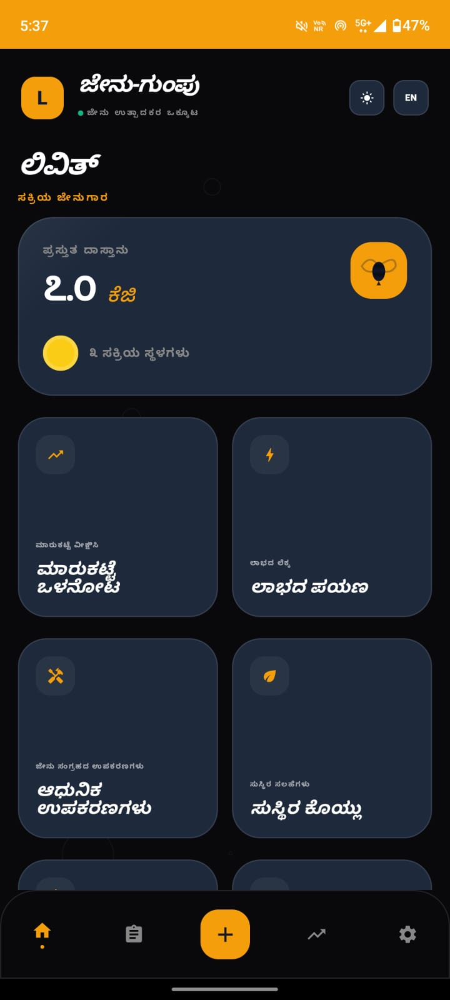
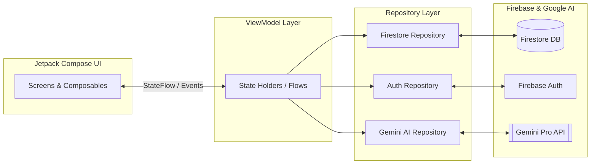

<div align="center">


# Jenu-Gumpu (ಜೇನು-ಗುಂಪು) 🐝
### Transforming Tribal Honey Harvesting through GenAI & Collective Intelligence

<p>
  <a href="https://kotlinlang.org/"></a>
  <a href="https://developer.android.com/compose"></a>
  <a href="https://firebase.google.com/"></a>
  <a href="https://deepmind.google/technologies/gemini/"></a>
</p>
<p>
  
  
  
  
  
</p>

<p><i>Bridging the gap between forest-dwelling honey producers and urban markets — one harvest at a time.</i></p>

</div>

---

## 📌 About the Project

In many tribal and forest-fringe regions of Karnataka, honey hunters sell 1kg of premium wild honey for a fraction of its urban retail value — a gap driven almost entirely by **information asymmetry** and dependence on middlemen.

**Jenu-Gumpu** ("Honey Collective" in Kannada) is an Android application built to close that gap. It gives individual and collective honey harvesters the same tools urban buyers already have: live market pricing, standardized quality grading, harvest traceability, and an AI assistant for sustainable practices — all in a bilingual, low-literacy-friendly interface designed for real forest conditions.

This project was developed as part of the **MindMatrix Internship Program**, with a focus on applying GenAI to genuine social-impact use cases.

---

## 🌟 Key Features

| Feature | Description |
|---|---|
| 🍯 **Harvest Management** | Full CRUD lifecycle for logging harvests — floral source, quantity, moisture level, and location, with automated batch-ID generation for traceability. |
| 📈 **Live Market Insight** | Real-time retail vs. wholesale price monitoring with custom Compose Canvas line charts and a regional price index across node clusters (e.g. Kodagu, Wayanad, Shimoga). |
| 🧠 **Jenu-Bee AI Assistant** | Gemini Pro–powered companion offering sustainable harvesting advice, grading tips, and purity-analysis guidance. |
| 🏅 **Grading Tool** | Chromameter-based (PFUND scale) grade determination with moisture-level input and instant Grade A+/A/B/C classification. |
| 💰 **ROI / Profit Journey** | A calculator showing how processing steps — filtering, moisture control, branding — convert raw liquid value into premium market yield. |
| 🌍 **Bilingual UX** | Fully native Kannada and English support, including numeral localization and font handling. |
| 🌓 **Adaptive Theming** | High-contrast Light/Dark modes optimized for outdoor visibility in variable forest lighting. |

---

## 📱 Screenshots

<div align="center">

### Onboarding & Identity
&nbsp;&nbsp;&nbsp;&nbsp;

*Bilingual Google Sign-In · Collective home dashboard · Editable profile with EN/KN display names*

<br>

### Harvest Workflow
&nbsp;&nbsp;&nbsp;&nbsp;

*Decentered traceability ledger · Log floral source, weight & moisture · AI-assisted grade determination (PFUND scale)*

<br>

### Live Market Insights


*Live retail/wholesale pricing with regional price-index tracking (Kodagu, Wayanad, Shimoga etc.,)*

</div>

---

## 🏗️ Architecture

The app follows a unidirectional-data-flow **MVVM** architecture with Firebase as the single source of truth, keeping the harvest ledger consistent across the collective in near real time.



---

## 🛠️ Tech Stack

| Layer | Technology |
|---|---|
| **Language** | Kotlin |
| **UI Toolkit** | Jetpack Compose (declarative, Material 3–based) |
| **Architecture** | MVVM (Model–View–ViewModel) |
| **Async / Reactive** | Kotlin Coroutines & Flow |
| **Backend** | Firebase Firestore (real-time NoSQL sync) |
| **Authentication** | Firebase Auth — Google Sign-In |
| **AI Integration** | Google Generative AI SDK (Gemini Pro) |
| **Localization** | Custom bilingual (Kannada / English) resource system |
| **Charts** | Custom Jetpack Compose Canvas–based line charts |

---

## 📂 Project Structure

```
jenu-gumpu/
├── app/
│   ├── src/main/java/com/livith/jenugumpu/
│   │   ├── data/            # Repositories, Firestore & Gemini data sources
│   │   ├── di/               # Dependency injection modules
│   │   ├── model/            # Data classes (Harvest, User, PriceIndex, etc.)
│   │   ├── ui/
│   │   │   ├── auth/         # Signup / Login
│   │   │   ├── dashboard/    # Collective home dashboard
│   │   │   ├── harvest/      # Harvest log & Add Record
│   │   │   ├── grading/      # AI Grading Tool
│   │   │   ├── market/       # Live Market Insights
│   │   │   └── profile/      # User Profile & Settings
│   │   ├── viewmodel/        # ViewModels per feature
│   │   └── util/             # Localization, formatting helpers
│   └── res/                  # Strings (en/kn), themes, drawables
├── gradle/
└── README.md
```

---

## ⚙️ Getting Started

### Prerequisites

- Android Studio (Koala or newer)
- JDK 17+
- A Firebase project with **Firestore** and **Google Authentication** enabled
- A **Gemini API key**

### Installation

```bash
# 1. Clone the repository
git clone https://github.com/<your-username>/jenu-gumpu.git
cd jenu-gumpu

# 2. Add Firebase configuration
#    Download google-services.json from your Firebase console
#    and place it in the app/ directory

# 3. Add your Gemini API key
#    Create/edit local.properties in the project root:
echo "GEMINI_API_KEY=your_api_key_here" >> local.properties

# 4. Build and run
./gradlew installDebug
```

---

## 🚀 How It Works

1. **Harvest** — A hunter logs their collection in the forest via the Add Record screen.
2. **Grade** — The hunter uses the visual PFUND reference and AI advice to classify honey (Grade A+ to C).
3. **Monitor** — Before selling, the hunter checks the Price Monitor for current retail and wholesale values.
4. **Collective Sync** — Every entry syncs to the cloud, letting the Collective Hub see total stock weight for stronger group bargaining.
5. **Manifest Profit** — The ROI calculator shows exactly how much value is gained after purification and packaging.

---

## 📈 Impact & Vision

**Jenu-Gumpu** changes the narrative for tribal honey producers by:

- **Eliminating information asymmetry** — giving producers the same pricing data buyers already have.
- **Ensuring sustainability** — AI-guided education on preserving bee colonies and forest ecosystems.
- **Building brand identity** — moving from "anonymous raw liquid" to "certified premium forest honey."

---

## 🗺️ Roadmap

- [ ] Offline-first sync for low-connectivity forest zones
- [ ] Voice-based harvest logging in Kannada
- [ ] Buyer-facing marketplace integration
- [ ] Multi-collective analytics dashboard for NGOs/co-ops
- [ ] Additional regional language support (Tulu, Malayalam)

---

## 🤝 Contributing

Contributions, issues, and feature requests are welcome.

1. Fork the project
2. Create your feature branch (`git checkout -b feature/amazing-feature`)
3. Commit your changes (`git commit -m 'Add some amazing feature'`)
4. Push to the branch (`git push origin feature/amazing-feature`)
5. Open a Pull Request

---

## 📬 Contact

**Livith Muthanna M A**

[](mailto:livithmuthanna@gmail.com)

---

<div align="center">
<sub>Made with 🐝 for the honey producers of Karnataka</sub>
</div>
